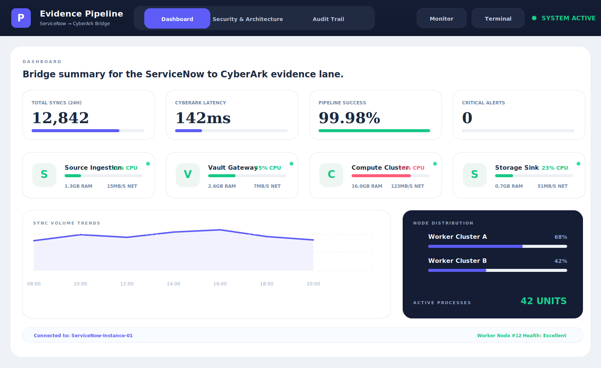
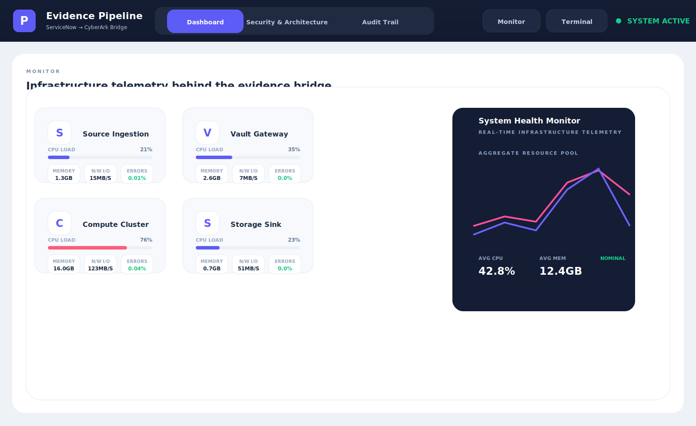
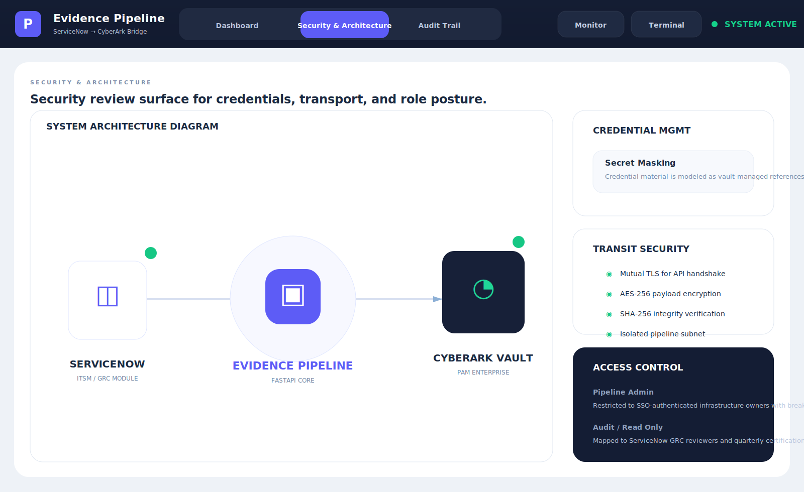
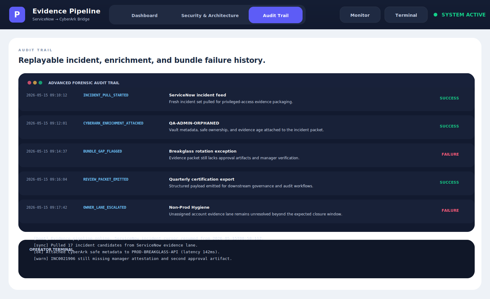

# ServiceNow CyberArk Evidence Pipeline

FastAPI pipeline for **collecting ServiceNow and CyberArk access-change events into audit-ready evidence records, security posture context, and privileged-review approval artifacts**.

> **What this repo proves**
>
> Incident workflow becomes much more useful when ticket state, vault context, approval artifacts, transport posture, and governance handoff targets all stay visible in the same lane.

## Why this repo exists

Most privileged-access workflows split the truth across too many systems:

- ServiceNow knows the incident state
- CyberArk knows the safe, account, and approval posture
- review teams know what evidence is missing
- audit teams only see the cleanup later

`servicenow-cyberark-evidence-pipeline` models the missing connective tissue. It treats incident handling, evidence packaging, and privileged-review closure as one pipeline instead of three disconnected steps.

## Screenshots






## What it includes

- Python + FastAPI service with HTML proof surfaces and JSON APIs
- modeled ServiceNow incident feed plus CyberArk safe/account enrichment
- risk scoring across priority, evidence age, artifact depth, ownership quality, dual approval, and exception pressure
- system monitor surface for sync throughput, latency, component load, and resource posture
- security and architecture surface for credential handling, transport safeguards, and role posture
- evidence bundle surface for governance, certification, and audit handoff
- integration posture view for ServiceNow inputs, CyberArk enrichment, and downstream targets
- screenshot generator, docs, origin story, changelog, tests, and CI

## Local run

```powershell
Set-Location "C:\Users\chaus\dev\repos\servicenow-cyberark-evidence-pipeline"
py -3.11 -m venv .venv
.\.venv\Scripts\python.exe -m pip install -r requirements.txt
.\.venv\Scripts\python.exe -m app.main
```

Then open:

- `http://127.0.0.1:5059/`
- `http://127.0.0.1:5059/pipeline-board`
- `http://127.0.0.1:5059/bundles`
- `http://127.0.0.1:5059/monitor`
- `http://127.0.0.1:5059/security-architecture`
- `http://127.0.0.1:5059/audit-log`
- `http://127.0.0.1:5059/integrations`
- `http://127.0.0.1:5059/docs`

If that port is busy:

```powershell
$env:PORT = "5064"
.\.venv\Scripts\python.exe -m app.main
```

## Validation

```powershell
.\.venv\Scripts\python.exe -m unittest discover -s tests
.\.venv\Scripts\python.exe scripts\run_demo.py
.\.venv\Scripts\python.exe scripts\smoke_check.py
.\.venv\Scripts\python.exe scripts\render_readme_assets.py
```

## API routes

- `GET /api/dashboard/summary`
- `GET /api/incidents`
- `GET /api/incidents/{incident_id}`
- `GET /api/pipeline-board`
- `GET /api/bundles`
- `GET /api/audit`
- `GET /api/health`
- `GET /api/security-architecture`
- `GET /api/terminal`
- `GET /api/integrations`
- `GET /api/sample`

## Repo layout

- `app/main.py` FastAPI routes and API surface
- `app/services/evidence_pipeline_service.py` scoring, packaging, and integration logic
- `app/render.py` HTML control surfaces
- `app/data/sample_pipeline_data.json` seeded incident/evidence dataset
- `docs/architecture.md` system structure and route model
- `docs/ORIGIN.md` why the product exists
